# daos-benchmarking
Notes doc: https://docs.google.com/document/d/1mf2JfuIG7SXV3KOU3kDi35w4nssFurwodq81qu-ZrRA/edit?usp=sharing 

# Graphs
All pictures are inside /graphs

Missing cases are due to failed container creation here.

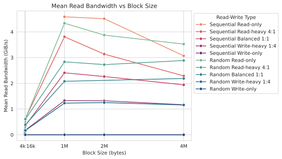
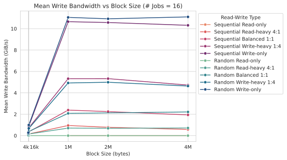
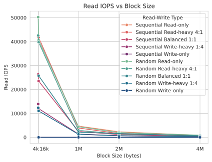
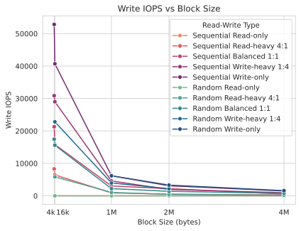
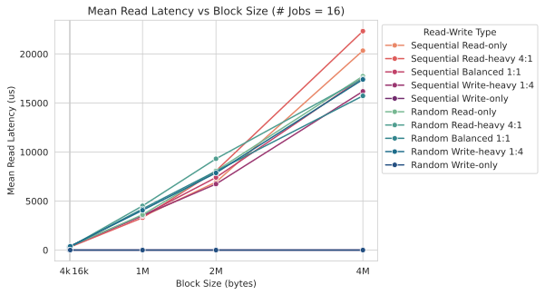
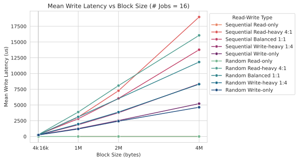

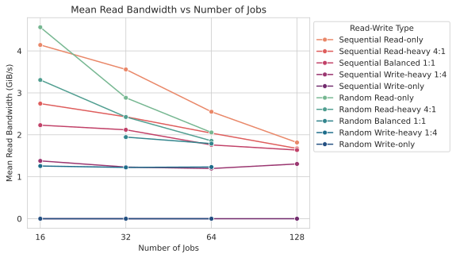
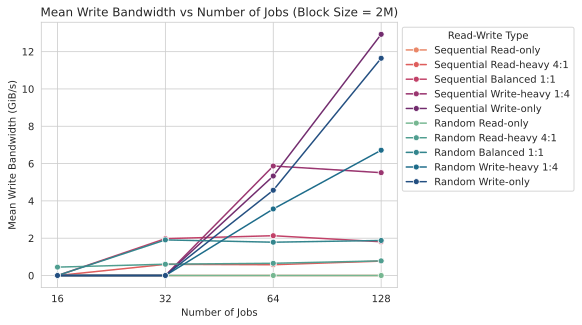
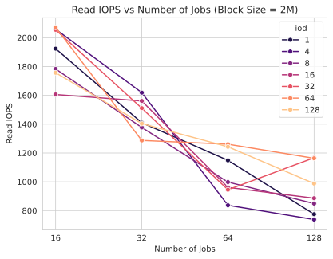
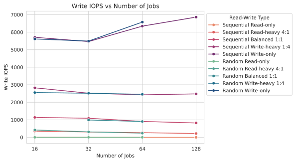
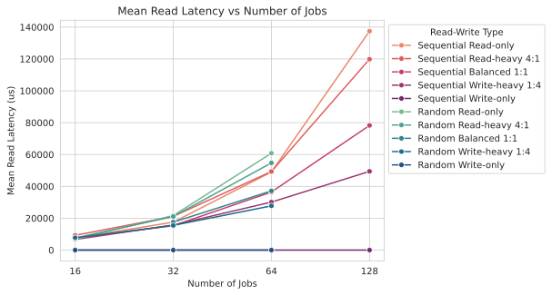
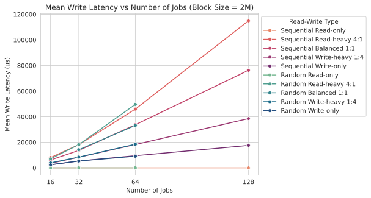
