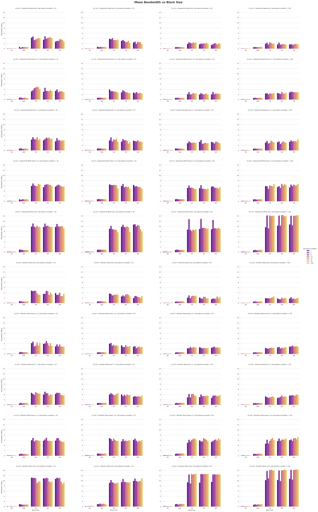
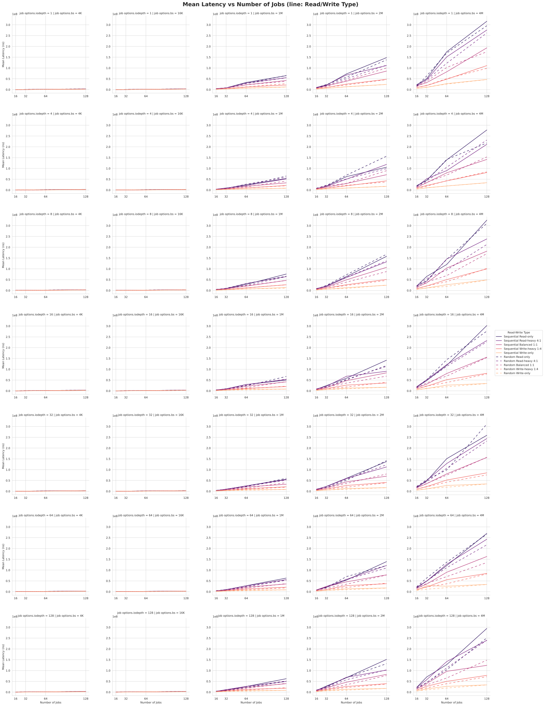

# daos-benchmarking
Notes doc: https://docs.google.com/document/d/1mf2JfuIG7SXV3KOU3kDi35w4nssFurwodq81qu-ZrRA/edit?usp=sharing 

# Graphs
There is a very bountiful amount of graphs - all can be found in `plot_fio.ipynb` or `plot_ior.ipynb`. 
Saved graphs will be stored in /graphs \

## Sample of images from plot_fio.ipynb:

