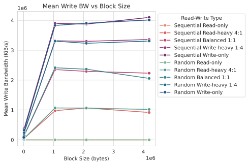

# daos-benchmarking
Notes doc: https://docs.google.com/document/d/1mf2JfuIG7SXV3KOU3kDi35w4nssFurwodq81qu-ZrRA/edit?usp=sharing 

So far I've only done fio command for each combination of block size and read/write setting so I could get some initial data. 
# Graphs
All pictures are inside /graphs

